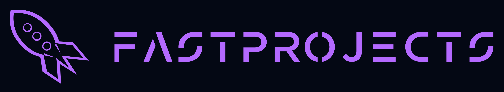

  

# 🚀 **FastProjects .NET**

A powerful collection of class libraries designed to streamline application development, built with **Clean Architecture** principles in mind.

> 🚨 ALERT: Projects Under Development
> The projects of this organization are not yet production-ready and are still under active development. Currently, it's being used primarily for personal development needs. However, contributions are more than welcome! If you'd like to collaborate, feel free to submit issues or pull requests. Your input can help shape the future of FastProjects!

---

## 📚 **Overview**

FastProjects .NET offers essential C# class libraries that accelerate your application development process. It also includes a Clean Architecture WebAPI template to kickstart your projects quickly.

⚙️ **Future Plans**: We're planning to launch a CLI tool to make .NET development faster than ever!

---

## 🛠 **Roadmap**

### **Class Libraries**:
- ✅ [**SharedKernel**](https://github.com/Fast-Projects-NET/FastProjects.SharedKernel) - Base classes for Clean Architecture projects.
- ✅ [**ResultPattern**](https://github.com/Fast-Projects-NET/FastProjects.ResultPattern) - Implementation of the Result pattern.
- ✅ [**Data.EntityFrameworkCore**](https://github.com/Fast-Projects-NET/FastProjects.Data.EntityFrameworkCore) - Contains the base `DbContext`, `UnitOfWork`, and implements Outbox/Inbox patterns with [MassTransit](https://masstransit.io/) integration. Also supports generic repository pattern.
- ✅ [**Messaging**](https://github.com/Fast-Projects-NET/FastProjects.Messaging) - Interfaces for integration events and messaging systems, including [MassTransit](https://masstransit.io/).
- ✅ [**Caching**](https://github.com/Fast-Projects-NET/FastProjects.Caching) - Interfaces for working with caching systems, e.g., [Redis](https://redis.io/) integration.
- ✅ [**Common**](https://github.com/Fast-Projects-NET/FastProjects.Common) - Utilities and helper classes for common application scenarios.
- ✅ [**Endpoints**](https://github.com/Fast-Projects-NET/FastProjects.Endpoints) - Base classes for endpoints, integrated with [FastEndpoints](https://fast-endpoints.com/).

### **Templates**:
- ⏳ **FastProjects.WebApi** - A full WebAPI project template built using Clean Architecture principles.
- ⏳ **ArchitectureTests** - Tests for validating architectural rules across projects.

### **Tools**:
- ⏳ **fpnet** (FastProjects .NET CLI) - A CLI tool with code generation for:
    - 📂 Project structure setup
    - 🏗 Adding entity/aggregate root with CRUD operations
    - 🛠 Configuring caching, notifications, messaging, logging, security, and more
    - 🚦 Setting up CI/CD, monitoring, and testing
- ⏳ **fpnet** - A GUI-based desktop application for managing **fpnet** features visually.

---
